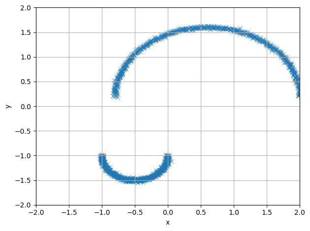
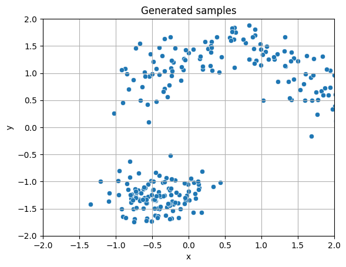

```python
import scipy
import numpy as np
import matplotlib.pyplot as plt
import seaborn as sns

from diffusion_on_the_edge.core.grid import TimeGrid
from diffusion_on_the_edge.processes import OUNumpy, OUParamsNP, OUTorch, OUTorchParams
from diffusion_on_the_edge.sde.np_backend import simulate_sde_np
```

<a id="diffusion-models-introduction"></a>
# Diffusion models - Introduction

Welcome!

This is a first part of a two-part series on diffusion models. Our end goal is to understand the paper __paper_name_here deeply, starting from the basic building blocks of diffusion models.


```python
def generate_example_dataset(n=5000, noise=0.01):
    circle_radius = 1.4
    second_radius = 0.5
    points = []
    for theta in np.linspace(0, np.pi, int(n // 2)):
        points.append([circle_radius * np.cos(theta) + 0.6, 0.2 + circle_radius * np.sin(theta)])
        points.append([second_radius * np.cos(theta + np.pi) - 0.5, second_radius * np.sin(theta + np.pi) - 1.0])

    # Add Gaussian noise
    points = np.array(points)
    points += np.random.normal(scale=noise, size=points.shape)

    return points


N = 2048
noise = 0.02
dataset = generate_example_dataset(n = N, noise = noise)
dataset.shape
```
<pre><code class="language-output">(2048, 2)</code></pre>

```python
sns.scatterplot(x = dataset[:, 0], y = dataset[:, 1], alpha = 0.8, marker = 'x').set(xlim=(-2, 2), ylim=(-2,2), xlabel='x', ylabel='y')
plt.grid()
plt.tight_layout()
```
<div class="nb-output">
  

    

    

  
</div>
This first introductory part guides you through the basic building blocks of diffusion models, starting from the continuous stochastic process. From there, we describe the mechanisms of reversing the process and show how neural networks are utilized in solving a backwards stochastic differential equation. Alongside solving the forward and backward stochastic differential equations, we show how the probability density flows from the initial configuration into the more evenly distributed end-state distribution. Analogous to the stochastic case, we also show how to reverse this probability flow using a learned model.


```python
process_params = OUParamsNP(dim = 2, theta = 0.5, mu = 0, sigma = 0.5)
process = OUNumpy(params=process_params)
grid = TimeGrid(t0=0, t1=1, N = 101)

X_t, times = simulate_sde_np(process, x0=dataset, grid = grid, method='exact')
X_t.shape
```
<pre><code class="language-output">(101, 2048, 2)</code></pre>

```python
from IPython.display import HTML
import matplotlib.animation as animation

fig, ax = plt.subplots(figsize=(8, 6))
scat = ax.scatter([], [], s=5)
cmap = plt.get_cmap('tab10')

def init():
    ax.set_xlim(-2, 2)
    ax.set_ylim(-2, 2)
    ax.set_title("Evolution of diffusion process $X_t$")
    ax.set_ylabel('$y$')
    ax.set_xlabel('$x$')
    return scat,

def update(frame):
    scat.set_offsets(X_t[frame])
    ax.set_title(f"t = {times[frame]:.2f}")
    return scat,

ani = animation.FuncAnimation(fig, update, frames=X_t.shape[0] - 1, init_func=init,
                              interval=100, blit=True)
plt.grid()
plt.close(fig)
ani.save('./assets/animation_forward.mp4')
```

The steps we will take in this blog post are:

1. Review of stochastic processes
2. Density flow
3. Backwards stochastic process
4. Inverting the density flow
5. Implementing a score model
6. Simple 2-dimensional example

<a id="review-of-stochastic-processes"></a>
# Review of stochastic processes

As a quick review, we define a stochastic process to be a process of real-valued random variables $X_t \in \mathbb{R}^d$, where $t \in [0, 1]$ and $d$ denotes the dimensionality of the random process. In practice and for visualization purposes, we usually deal with random processes in dimension $d = 1, 2$ or $3$. Also, let $p_t$ denote the probability density of $X_t$ at time $t$.


```python
def density_on_grid(X0, times, xlim=(-3,3), ylim=(-3,3), n_points=100):
    """
    Compute OU mixture density on a 2D grid for multiple time values.
    
    X0: (N,2) initial points
    times: list or array of times [t1, t2, ...]
    xlim, ylim: ranges for grid
    n_points: number of grid points in each dimension
    """

    
    xs = np.linspace(xlim[0], xlim[1], n_points)
    ys = np.linspace(ylim[0], ylim[1], n_points)
    X, Y = np.meshgrid(xs, ys)
    grid_points = np.column_stack([X.ravel(), Y.ravel()])
    densities = {}
    for t in times:
        dens = np.zeros(grid_points.shape[0])
        for _, x0 in enumerate(X0):
            # Get the mean and std of the transition distribution, conditioned on x_0.
            mean, std = process.transition_mean_std(x0, t)
            # Create a grid of values for the probability density
            density_values = scipy.stats.multivariate_normal.pdf(grid_points, mean = mean, cov = np.diag(std ** 2))
            dens += density_values
        dens = dens / dens.sum() # Approximate probability density p(x, t)
        densities[t] = dens.reshape(n_points, n_points)
    return xs, ys, densities

```


```python
times = np.linspace(0.1, 1.0, num = 25)
xs, ys, dens_dict = density_on_grid(dataset, times = times)

# Keep densities ordered to match 'times'
dens_list = [dens_dict[t] for t in times]

# Global color scale for fair comparison
vmin = min(d.min() for d in dens_list)
vmax = max(d.max() for d in dens_list)

# 2) Set up figure & first frame
fig, ax = plt.subplots(figsize=(6, 5))
im = ax.imshow(
    dens_list[0],
    origin="lower",
    extent=[xs[0], xs[-1], ys[0], ys[-1]],
    aspect="equal",
    vmin=vmin, vmax=vmax,
    cmap="viridis",
)
cb = plt.colorbar(im, ax=ax, label="density")
title = ax.set_title(f"OU density at t = {times[0]:.3f}")
ax.set_xlabel("x"); ax.set_ylabel("y")

# 3) Animation update
def update(i):
    im.set_data(dens_list[i])
    title.set_text(f"OU density at t = {times[i]:.3f}")
    return (im,)

ani = animation.FuncAnimation(fig, update, frames=len(times), interval=400, blit=False)
plt.close(fig)
ani.save('./assets/animation_density.mp4')
```

An example of a stochastic process is geometric brownian motion, $dX_t = \sigma dW_t, \sigma \gt 0$, where $dW_t$ denotes the standard $d$-dimensional brownian noise. We often characterize a stochastic process as a stochastic differential equation, $dX_t = (\text{something })dt + (\text{something else })dW_t$, with a deterministic part describing the general trend, an a stochastic noise part which describes the deviation of that trend.

The particular stochastic process which we utilize in this blog post is an Ornstein–Uhlenbeck process, also shortened as an OU process. An OU process has a form like

$$
dX_t = -\lambda X_t dt + \sigma dW_t
$$

where $\lambda > 0$ and $\sigma > 0$ are simple constants.


```python
import torch
from torch.utils.data.dataloader import DataLoader
from diffusion_on_the_edge.data.ou_dataset import OUDiffusionDatasetVectorized
```


```python
# Instantiate the dataset and dataloader
batch_size = 32
batches_per_epoch = N // batch_size

torch_params = OUTorchParams(dim = process.dim, theta=torch.tensor(process.theta), mu=torch.tensor(0), sigma=torch.tensor(process.sigma))
torch_process = OUTorch(torch_params)

diffusion_dataset = OUDiffusionDatasetVectorized(torch_process, torch.tensor(dataset), T_max = 1.0, batch_size=batch_size, batches_per_epoch=batches_per_epoch)
dataloader = DataLoader(diffusion_dataset, batch_size=None, num_workers=0)
```


```python
# Implementation of the neural network for learning the score
from diffusion_on_the_edge.modeling.model import SimpleScoreNet
from diffusion_on_the_edge.modeling.training import train_scorenet, TrainConfig
```


```python
training_conf = TrainConfig(epochs=20, lr = 0.001)
model = SimpleScoreNet(input_dimension=2, hidden_dim=512, time_emb_dim=2)
model
```
<pre><code class="language-output">SimpleScoreNet(
  (time_emb): SinusoidalTimeEmbedding()
  (net): Sequential(
    (0): Linear(in_features=4, out_features=512, bias=True)
    (1): ReLU(inplace=True)
    (2): Linear(in_features=512, out_features=512, bias=True)
    (3): ReLU(inplace=True)
    (4): Linear(in_features=512, out_features=2, bias=True)
  )
)</code></pre>

```python
# Training the model
training_dict = train_scorenet(model, dataloader, training_conf)
trained_model = training_dict['model']
training_losses = training_dict['losses']
```
<pre><code class="language-output">Epoch 1/20: 64it [00:00, 510.96it/s, loss=9.4]</code></pre><pre><code class="language-output">Epoch 1: avg loss = 9.402430</code></pre><pre><code class="language-output">Epoch 2/20: 64it [00:00, 810.97it/s, loss=6.91]</code></pre><pre><code class="language-output">Epoch 2: avg loss = 6.908520</code></pre><pre><code class="language-output">Epoch 3/20: 64it [00:00, 921.50it/s, loss=6.41]</code></pre><pre><code class="language-output">Epoch 3: avg loss = 6.406269</code></pre><pre><code class="language-output">Epoch 4/20: 64it [00:00, 915.02it/s, loss=6.3]</code></pre><pre><code class="language-output">Epoch 4: avg loss = 6.301235</code></pre><pre><code class="language-output">Epoch 5/20: 64it [00:00, 943.76it/s, loss=6.18]</code></pre><pre><code class="language-output">Epoch 5: avg loss = 6.179082</code></pre><pre><code class="language-output">Epoch 6/20: 64it [00:00, 792.48it/s, loss=5.78]</code></pre><pre><code class="language-output">Epoch 6: avg loss = 5.776006</code></pre><pre><code class="language-output">Epoch 7/20: 64it [00:00, 914.91it/s, loss=5.59]</code></pre><pre><code class="language-output">Epoch 7: avg loss = 5.587899</code></pre><pre><code class="language-output">Epoch 8/20: 64it [00:00, 915.67it/s, loss=5.86]</code></pre><pre><code class="language-output">Epoch 8: avg loss = 5.859952</code></pre><pre><code class="language-output">Epoch 9/20: 64it [00:00, 934.33it/s, loss=5.82]</code></pre><pre><code class="language-output">Epoch 9: avg loss = 5.823315</code></pre><pre><code class="language-output">Epoch 10/20: 64it [00:00, 929.15it/s, loss=5.85]</code></pre><pre><code class="language-output">Epoch 10: avg loss = 5.851666</code></pre><pre><code class="language-output">Epoch 11/20: 64it [00:00, 931.25it/s, loss=5.69]</code></pre><pre><code class="language-output">Epoch 11: avg loss = 5.685322</code></pre><pre><code class="language-output">Epoch 12/20: 64it [00:00, 725.37it/s, loss=5.58]</code></pre><pre><code class="language-output">Epoch 12: avg loss = 5.575598</code></pre><pre><code class="language-output">Epoch 13/20: 64it [00:00, 939.16it/s, loss=5.61]</code></pre><pre><code class="language-output">Epoch 13: avg loss = 5.609481</code></pre><pre><code class="language-output">Epoch 14/20: 64it [00:00, 944.83it/s, loss=5.78]</code></pre><pre><code class="language-output">Epoch 14: avg loss = 5.783751</code></pre><pre><code class="language-output">Epoch 15/20: 64it [00:00, 940.97it/s, loss=5.77]</code></pre><pre><code class="language-output">Epoch 15: avg loss = 5.771783</code></pre><pre><code class="language-output">Epoch 16/20: 64it [00:00, 936.48it/s, loss=5.07]</code></pre><pre><code class="language-output">Epoch 16: avg loss = 5.071712</code></pre><pre><code class="language-output">Epoch 17/20: 64it [00:00, 941.42it/s, loss=5.93]</code></pre><pre><code class="language-output">Epoch 17: avg loss = 5.932956</code></pre><pre><code class="language-output">Epoch 18/20: 64it [00:00, 945.60it/s, loss=5]</code></pre><pre><code class="language-output">Epoch 18: avg loss = 4.998591</code></pre><pre><code class="language-output">Epoch 19/20: 64it [00:00, 937.01it/s, loss=5.13]</code></pre><pre><code class="language-output">Epoch 19: avg loss = 5.127554</code></pre><pre><code class="language-output">Epoch 20/20: 64it [00:00, 826.63it/s, loss=5.44]</code></pre><pre><code class="language-output">Epoch 20: avg loss = 5.437289</code></pre><pre><code class="language-output"></code></pre>
<a id="example-of-an-ornstein-uhlenbeck-process"></a>
## Example of an Ornstein-Uhlenbeck process


```python
from matplotlib.animation import FuncAnimation

# Define a grid of 2D points
x_vals = np.linspace(-2, 2, 30)
y_vals = np.linspace(-2, 2, 30)
X, Y = np.meshgrid(x_vals, y_vals)
T = 1.0
grid = np.stack([X.ravel(), Y.ravel()], axis=-1)

# Time steps
time_steps = torch.linspace(0.0, T, steps=50)

# Precompute score fields at different time steps
fields = []
for t in time_steps:
    x_tensor = torch.tensor(grid, dtype=torch.float32)
    t_tensor = torch.full((x_tensor.shape[0], 1), t.item(), dtype=torch.float32)
    with torch.no_grad():
        vecs = trained_model(x_tensor, t_tensor.squeeze()).numpy()
    fields.append(vecs)

# Set up plot
fig, ax = plt.subplots(figsize=(6, 6))
ax.set_aspect('equal')
ax.set_xlim([-2, 2])
ax.set_ylim([-2, 2])
title = ax.set_title("")

# Initial quiver
U0, V0 = fields[0][:, 0], fields[0][:, 1]
magnitude0 = np.sqrt(U0**2 + V0**2)
quiver = ax.quiver(X, Y, U0/magnitude0, V0/magnitude0, magnitude0,
                   cmap='viridis', clim=[0, np.max(magnitude0)],
                   scale=30, pivot='middle')

cbar = fig.colorbar(quiver, ax=ax, orientation='vertical', label='Gradient Magnitude')

# Update function
def update(frame):
    frame = len(time_steps) - frame - 1
    U, V = fields[frame][:, 0], fields[frame][:, 1]
    mag = np.sqrt(U**2 + V**2)
    quiver.set_UVC(U/mag, V/mag, mag)
    title.set_text(f"Score Field at t = {time_steps[frame].item():.2f}")
    return quiver, title

ani = FuncAnimation(fig, update, frames=len(time_steps), interval=300)
plt.tight_layout()
plt.close(fig)

HTML(ani.to_jshtml())
ani.save('./assets/score_field_intro.mp4')
```

Beginning with a simple example, suppose we have a 2-dimensional diffusion process ($d = 2$) with a starting dataset $X_0$ composed of two ring shaped distributions.

We can now apply an OU diffusion process with specific parameters $\lambda = 0.4, \sigma = 0.5$ and visualize it as an animation. The animation shows how the initial dataset gets diffused into a pointcloud with no discernable features.

<video width="360" height="280" controls>
  <source src="assets/animation-forward.3a447862.mp4" type="video/mp4">
</video>


```python
from diffusion_on_the_edge.sde.torch_backend import reverse_pc_sampler_torch
```


```python
generation_size = 256
means = torch.zeros(2 * generation_size)
stds = torch.ones(2 * generation_size)

normal_values = torch.normal(means, stds).reshape(generation_size, 2)

generated_samples = reverse_pc_sampler_torch(
    normal_values,
    process=torch_process,
    score_model=trained_model,
    grid=TimeGrid()
)
```


```python
sns.scatterplot(x = generated_samples[:, 0].numpy(), y = generated_samples[:, 1].numpy()).set(
    xlim=(-2, 2), ylim=(-2, 2), 
    xlabel='x', ylabel='y', 
    title='Generated samples'
)
plt.grid()
```
<div class="nb-output">
  

    

    

  
</div>
As we can see, the animation shows how the initial dataset gets distorted into a gaussian blob.

<a id="density-flow"></a>
# Density flow
