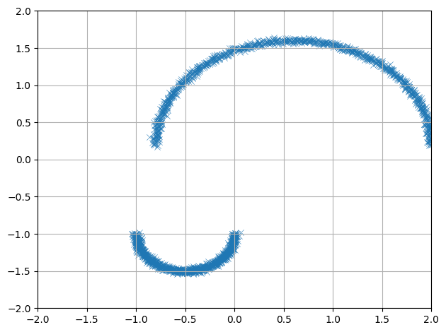
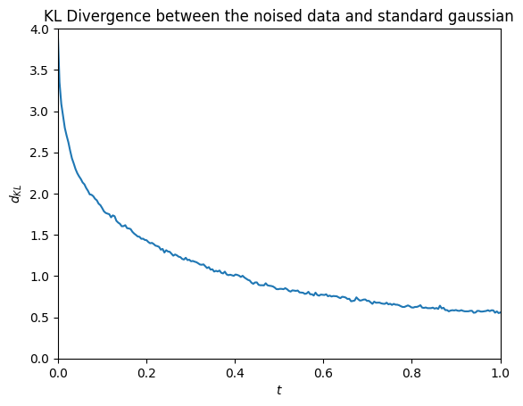
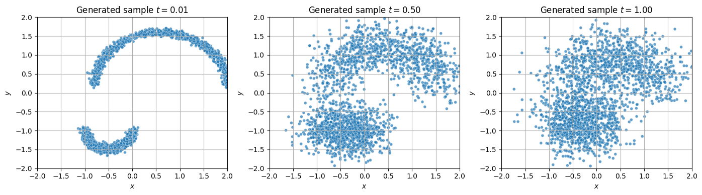
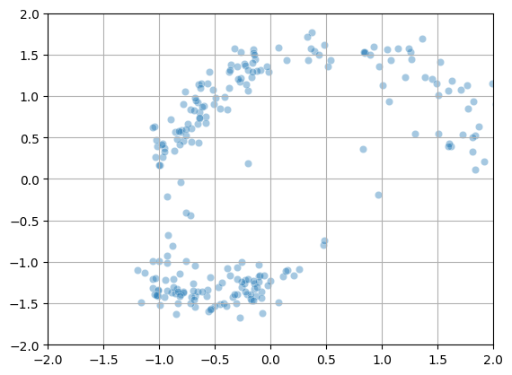
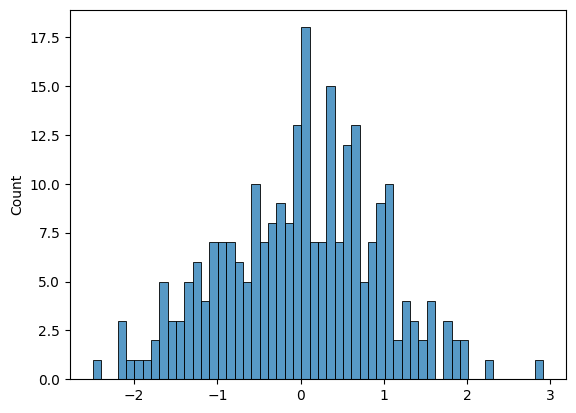
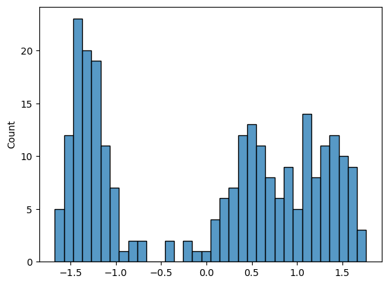

```python
import numpy as np
import matplotlib.pyplot as plt
import seaborn as sns
import torch.nn as nn
```


```python
N = 2048
noise = 0.02
```


```python
def generate_example_dataset(n=5000, noise=0.01):
    points = []

    N_circle = n

    # half circles
    circle_radius = 1.4
    second_radius = 0.5
    for theta in np.linspace(0, np.pi, int(N_circle // 2)):
        points.append([circle_radius * np.cos(theta) + 0.6, 0.2 + circle_radius * np.sin(theta)])
        # second smaller half circle
        points.append([second_radius * np.cos(theta + np.pi) - 0.5, second_radius * np.sin(theta + np.pi) - 1.0])

    # Add Gaussian noise
    points = np.array(points)
    points += np.random.normal(scale=noise, size=points.shape)

    return points
```


```python
dataset = generate_example_dataset(n = N, noise = noise)
dataset.shape
```
<pre><code class="language-output">(2048, 2)</code></pre>

```python
sns.scatterplot(x = dataset[:, 0], y = dataset[:, 1], alpha = 0.8, marker = 'x').set(xlim=(-2, 2), ylim=(-2,2))
plt.grid()
plt.tight_layout()
```
<div class="nb-output">


    

    

  
</div>
# Diffusion model - forward pass

In a diffusion model, we first make a forward pass by adding some noise to our original dataset.  

More specifically, at step $t$, we should have a sample generated from the diffusion model 

$$
\text{d}X_t = f(X_t, t) \text{d} t + g(t)\text{d}B_t
$$

for a drift function $f: \mathbb{R}^d \times \mathbb{R}^+ \to \mathbb{R}^d$ and diffusion function $g: \mathbb{R}^+ \to \mathbb{R}^+$.  

## Discretization

Of course in practice, we discretize the steps as being $t = 0, \Delta t, 2\Delta t, \dots, T$ for some final time $T$ and even spacing $\Delta t$.  
For simplicity in this example, we set the drift function to simply be a small scale down, $f(X_t, t) = -\lambda X_t$.
We set the diffusion term to be just a constant $g(t) = \sigma, \sigma \gt 0$.  
Then, the discretization rule becomes

$$
X_{t + \Delta t} = X_t -\lambda X_t \Delta t + \sigma \sqrt{\Delta t} \epsilon 
$$

where $\epsilon \sim \mathcal{N}(0, \mathbf{I})$ is a multivariate standard gaussian.


```python
T = 1
delta_t = 0.004
N_t = int(T / delta_t)
lambda_coeff = 0.5
sigma = 0.5
t_range = np.linspace(0, T, N_t)
print(f"T array shape: {t_range.shape}")
```
<pre><code class="language-output">T array shape: (250,)</code></pre>

```python
# Compute the discretized forward pass
X_t = [dataset.copy()]
X_curr = X_t[0]
for i in range(t_range.shape[0] - 1):
    X_tnew = X_curr -lambda_coeff * X_curr * delta_t + sigma * np.sqrt(delta_t) * np.random.normal(0, 1, size = X_curr.shape)
    X_t.append(X_tnew)
    X_curr = X_tnew
X_t = np.asarray(X_t)
X_t.shape
```
<pre><code class="language-output">(250, 2048, 2)</code></pre>

```python
# Also here the Kullback-Leibner divergence to a standard gaussian
from scipy.stats import multivariate_normal
from sklearn.neighbors import NearestNeighbors
import math

def estimate_entropy_knn(X, k=5):
    """Kozachenko-Leonenko estimator of differential entropy."""
    n, d = X.shape
    nbrs = NearestNeighbors(n_neighbors=k + 1).fit(X)
    distances, _ = nbrs.kneighbors(X)
    r = distances[:, -1]  # k-th NN distance
    volume_unit_ball = np.pi ** (d / 2) / math.gamma(d / 2 + 1)
    return (
        -np.log(k) + np.log(n - 1)
        + d * np.mean(np.log(r + 1e-12))
        + np.log(volume_unit_ball)
    )

def kl_to_standard_normal_from_samples(X, k=5):
    """Estimate KL(p_data || N(0, I)) from raw samples."""
    entropy = estimate_entropy_knn(X, k)
    log_probs = multivariate_normal.logpdf(X, mean=np.zeros(X.shape[1]), cov=np.eye(X.shape[1]))
    cross_entropy = -np.mean(log_probs)
    return cross_entropy - entropy

distances = []
for X in X_t:
    kl_distance = kl_to_standard_normal_from_samples(X)
    distances.append(kl_distance)
distances = np.asarray(distances)
distances.shape
```
<pre><code class="language-output">(250,)</code></pre>
### Visualization of a simple diffusion process


```python
from IPython.display import HTML
import matplotlib.animation as animation

fig, ax = plt.subplots(figsize=(8, 6))
scat = ax.scatter([], [], s=5)
cmap = plt.get_cmap('tab10')

def init():
    ax.set_xlim(-2, 2)
    ax.set_ylim(-2, 2)
    ax.set_title("Evolution of diffusion process $X_t$")
    ax.set_ylabel('$y$')
    ax.set_xlabel('$x$')
    return scat,

def update(frame):
    scat.set_offsets(X_t[frame])
    ax.set_title(f"t = {t_range[frame]:.2f}")
    return scat,

ani = animation.FuncAnimation(fig, update, frames=X_t.shape[0] - 1, init_func=init,
                              interval=100, blit=True)
plt.grid()
plt.close(fig)
HTML(ani.to_jshtml())
```
<pre><code class="language-output">&lt;IPython.core.display.HTML object&gt;</code></pre>

```python
# Visualize the KL divergence
sns.lineplot(y = distances, x = t_range).set(
    title = 'KL Divergence between the noised data and standard gaussian', 
    xlabel = '$t$', 
    ylabel = '$d_{KL}$', 
    xlim=(0, t_range.max()),
    ylim=(0,4.0)
);
```
<div class="nb-output">


    

    

  
</div>
From the plot above, we can note that the Kullbeck-Leibner divergence has a clear decreasing trend. This corresponds to the fact that as the process continues, the likely distribution of samples tends towards a standard gaussian. In other words, the diffuse process destroys the information contained in the original more structured dataset $X_0$.

## Analytical expression for distribution

For a this simple diffusion process $X_t$ we can derive an analytical distribution for each time $t \gt 0$.  

$$
\boxed{
X_t \sim \mathcal{N} \left( e^{-\lambda t} X_0,\; \frac{\sigma^2}{2\lambda} \left( 1 - e^{-2\lambda t} \right) I \right)
}
$$

Using this expression, we can generate new samples at each timestep without having to trace an entire path numerically.  
This will be useful later on as we use machine learning to reverse the process. Below we implement the code for drawing these samples and also visualize some of the points generated.


```python
def generate_diffusion_sample(t: float, X_0: np.ndarray, lambda_coeff: float, sigma: float, size: int = 1):
    decay = np.exp(-lambda_coeff * t)
    std = np.sqrt((sigma**2) / (2 * lambda_coeff) * (1 - np.exp(-2 * lambda_coeff * t)))
    mean = decay * X_0
    noise = np.random.normal(loc=0.0, scale=std, size=X_0.shape)
    return mean + noise
```


```python
example_times = [0.01, 0.5, T]
generated_sample_examples = [generate_diffusion_sample(t, X_0 = X_t[0], lambda_coeff = lambda_coeff, sigma = sigma) for t in example_times]
```


```python
fig, ax = plt.subplots(1, 3, figsize=(14, 4))
for i in range(len(ax)):
    samples = generated_sample_examples[i]
    sns.scatterplot(x = samples[:, 0], y = samples[:, 1], ax = ax[i], legend=False, alpha = 0.7, size=0.2).set(
        title = f'Generated sample $t = {example_times[i]:.2f}$',
        xlabel = '$x$',
        ylabel='$y$',
        xlim=(-2, 2),
        ylim=(-2, 2),
    )
    ax[i].legend = None
    ax[i].grid()
plt.tight_layout()
```
<div class="nb-output">


    

    

  
</div>
Plots above illustrate that we can draw samples $X_t$ without following through the whole trajectory.  
This approach is however dependent on our particular choice of the process since for general stochastic processes we cannot find an analytical expression for the sample probability.

# Appendix (Optional): Deriving the Fokker-Planck Equation — Step by Step

Let’s take a careful look at how the Fokker-Planck equation arises from a diffusion process defined by the stochastic differential equation (SDE)

$$
dX_t = f(X_t, t) \, dt + g(t) \, dB_t,
$$

where $X_t$ is a $d$-dimensional stochastic process, $f$ is a drift term, $g(t)$ is a scalar diffusion coefficient, and $B_t$ is standard Brownian motion in $\mathbb{R}^d$.

## The Assumptions We Need

We assume:
- The drift $f(x, t)$ and diffusion coefficient $g(t)$ are bounded, continuous, and Lipschitz in $x$,
- The SDE admits a unique strong solution $X_t$,
- The law of $X_t$ admits a smooth probability density $p(x, t)$ with respect to Lebesgue measure,
- We work with smooth test functions $\phi(x)$ of compact support.

These assumptions ensure that all the differential, expectation, and integration operations we use are mathematically justified.

---

## Applying Itô’s Formula

We begin with Itô’s formula applied to $\phi(X_t)$:

$$
d\phi(X_t) = \nabla_x \phi(X_t)^\top f(X_t, t) \, dt + \frac{1}{2} g^2(t) \, \Delta \phi(X_t) \, dt + \nabla_x \phi(X_t)^\top g(t) \, dB_t.
$$

We then integrate both sides over time from $0$ to $t$:

$$
\phi(X_t) = \phi(X_0) + \int_0^t \nabla_x \phi(X_s)^\top f(X_s, s) \, ds + \frac{1}{2} \int_0^t g^2(s) \, \Delta \phi(X_s) \, ds + \int_0^t \nabla_x \phi(X_s)^\top g(s) \, dB_s.
$$

---

## Taking Expectations

Taking expectations eliminates the stochastic integral (its expectation is zero), giving

$$
\mathbb{E}[\phi(X_t)] = \mathbb{E}[\phi(X_0)] + \int_0^t \mathbb{E} \left[ \nabla_x \phi(X_s)^\top f(X_s, s) \right] ds + \frac{1}{2} \int_0^t g^2(s) \, \mathbb{E} \left[ \Delta \phi(X_s) \right] ds.
$$

---

## Differentiating with Respect to Time

Differentiating both sides with respect to $t$, we obtain

$$
\frac{d}{dt} \mathbb{E}[\phi(X_t)] = \mathbb{E} \left[ \nabla_x \phi(X_t)^\top f(X_t, t) \right] + \frac{1}{2} g^2(t) \, \mathbb{E} \left[ \Delta \phi(X_t) \right].
$$

---

## Expressing Expectations as Integrals over the Density

Since $X_t$ has density $p(x, t)$, we can write

$$
\mathbb{E}[\phi(X_t)] = \int_{\mathbb{R}^d} \phi(x) \, p(x, t) \, dx.
$$

Substituting this into our differentiated expression gives

$$
\frac{d}{dt} \int_{\mathbb{R}^d} \phi(x) \, p(x, t) \, dx = \int_{\mathbb{R}^d} \nabla_x \phi(x)^\top f(x, t) \, p(x, t) \, dx + \frac{1}{2} g^2(t) \int_{\mathbb{R}^d} \Delta \phi(x) \, p(x, t) \, dx.
$$

---

## Integration by Parts — Moving Derivatives to $p(x, t)$

Using integration by parts and assuming $\phi$ has compact support:

- The drift term becomes

$$
\int \nabla_x \phi(x)^\top f(x, t) \, p(x, t) \, dx = - \int \phi(x) \, \nabla_x \cdot \left( f(x, t) \, p(x, t) \right) \, dx.
$$

- The diffusion term becomes

$$
\int \Delta \phi(x) \, p(x, t) \, dx = \int \phi(x) \, \Delta p(x, t) \, dx.
$$

---

## The Weak Form of the Fokker-Planck Equation

We now have

$$
\frac{d}{dt} \int \phi(x) \, p(x, t) \, dx = \int \phi(x) \left( - \nabla_x \cdot (f p) + \frac{1}{2} g^2(t) \, \Delta p \right) dx.
$$

Since this holds for arbitrary smooth test functions $\phi(x)$, the **strong form** of the **Fokker-Planck equation** follows:

$$
\frac{\partial p}{\partial t} = - \nabla_x \cdot (f p) + \frac{1}{2} g^2(t) \, \Delta p.
$$

This describes how probability mass evolves over time — the drift moves it deterministically, while the diffusion spreads it out due to randomness.


# Implementing reversed SDE

Now we have seen how the time-reversed diffusion process is theoretically derived. The main term of interest is the score function $\log \nabla_x p(x)$ which is used to reverse the drift of the stochastic process. However, in practice we do not have an analytic expression for the score function but rather we must learn it from data.

In the next section, we will build a machine learning architecture for modeling the score function. Later on, we will use the learned score function to draw new samples from the original data distribution. We can then generate new samples which have similar distribution to the original data. Finally, we visualize the distributions of the new samples and compare them to the original dataset and see how we have generated similar samples from just gaussian noise!


```python
import torch
from torch.utils.data import IterableDataset, DataLoader

# Generate samples from the forward process
def sample_xt_and_score(x0_batch, t_batch, lambda_coeff, sigma):
    exp_factor = torch.exp(-lambda_coeff * t_batch)
    mean = exp_factor * x0_batch
    var = (sigma ** 2) / (2 * lambda_coeff) * (1 - exp_factor ** 2)
    std = torch.sqrt(var)
    epsilon = torch.randn_like(x0_batch)
    xt = mean + std * epsilon
    # Add small noise to denominator for avoiding numerical issues
    score_target = -(xt - mean) / (var + 1E-9)
    return xt, score_target, var


# Dataset implementation
class DiffusionDataIterator(IterableDataset):
    def __init__(self, x0_data, lambda_coeff, sigma):
        super().__init__()
        self.x0_data = torch.tensor(x0_data, dtype=torch.float32)
        self.lambda_coeff = lambda_coeff
        self.sigma = sigma

    def __iter__(self):
        while True:
            idx = torch.randint(0, self.x0_data.size(0), (1,)).item()
            x0 = self.x0_data[idx]
            eps = 1E-5 # Small epsilon to avoid having strightly t = 0. 
            t = torch.rand(1) * (1.0 - eps) + eps
            xt, score, var = sample_xt_and_score(x0.unsqueeze(0), t.unsqueeze(0), self.lambda_coeff, self.sigma)
            yield xt.squeeze(0), t, score.squeeze(0), var.squeeze(0)

```


```python
# Instantiate the dataset and dataloader
batch_size = 32
dataset = DiffusionDataIterator(X_t[0], lambda_coeff = lambda_coeff, sigma = sigma)
dataloader = DataLoader(dataset, batch_size=batch_size, num_workers=0)
```

### Score learning network

Here we have a simple 2 layer fully-connected MLP network for learning the score function $s_\theta(x, t)$.  
Each sample we give the network is a vector $(x, y, t)^T$ and we optimize the network to minimize the difference in the probability gradient

TODO: Here equation for the score optimization
$$

$$


```python
# Implementation of the neural network for learning the score
import torch.nn as nn
class SimpleScoreNet(nn.Module):
    def __init__(self, hidden_dim=512):
        super().__init__()
        self.net = nn.Sequential(
            nn.Linear(3, hidden_dim),
            nn.ReLU(),
            nn.Linear(hidden_dim, hidden_dim),
            nn.ReLU(),
            nn.Linear(hidden_dim, 2)
        )

    def forward(self, x, t):
        inp = torch.cat([x, t], dim=-1)
        return self.net(inp)

```


```python
model = SimpleScoreNet(hidden_dim=512)
model
```
<pre><code class="language-output">SimpleScoreNet(
  (net): Sequential(
    (0): Linear(in_features=3, out_features=512, bias=True)
    (1): ReLU()
    (2): Linear(in_features=512, out_features=512, bias=True)
    (3): ReLU()
    (4): Linear(in_features=512, out_features=2, bias=True)
  )
)</code></pre>

```python
# Training loop
EPOCHS = 50
num_batches = N // batch_size
dataloader_iter = iter(dataloader)
epoch_loss_history = []
optimizer = torch.optim.Adam(model.parameters(), lr=0.001)
for epoch in range(EPOCHS):
    epoch_losses = []
    for i in range(num_batches):
        optimizer.zero_grad()
        batch = next(dataloader_iter)
        xt, t, score, var = batch
        predicted_score_gradient = model(xt, t)

        # Prevent exploding weights at small var
        omega = torch.clamp(var, min=1e-3, max=10.0)
        omega = omega / omega.mean()

        # Compute loss
        loss = torch.sum((predicted_score_gradient - score) ** 2, dim=1)
        loss = torch.mean(loss * omega)

        loss.backward()
        #nn.utils.clip_grad_norm_(model.parameters(), 1.0)
        optimizer.step()
        with torch.no_grad():
            epoch_losses.append(loss.item())
    epoch_loss = np.mean(epoch_losses)
    epoch_loss_history.append(epoch_loss)
epoch_loss_history = np.asarray(epoch_loss_history)
assert epoch_loss_history.shape[0] == EPOCHS, "something wrong with training loop"
```

We should now have a trained score model $s_\theta$. We can now visualize the score as function of position and time.  
This vector field corresponds to $\log \nabla_x p(X_t | X_0)$, the correct direction for a sample to move to increase likelihood under the initial data.


```python
from matplotlib.animation import FuncAnimation

# Define a grid of 2D points
x_vals = np.linspace(-2, 2, 30)
y_vals = np.linspace(-2, 2, 30)
X, Y = np.meshgrid(x_vals, y_vals)
grid = np.stack([X.ravel(), Y.ravel()], axis=-1)

# Time steps
time_steps = torch.linspace(0.0, T, steps=50)

# Precompute score fields at different time steps
fields = []
for t in time_steps:
    x_tensor = torch.tensor(grid, dtype=torch.float32)
    t_tensor = torch.full((x_tensor.shape[0], 1), t.item(), dtype=torch.float32)
    with torch.no_grad():
        vecs = model(x_tensor, t_tensor).numpy()
    fields.append(vecs)

# Set up plot
fig, ax = plt.subplots(figsize=(6, 6))
ax.set_aspect('equal')
ax.set_xlim([-2, 2])
ax.set_ylim([-2, 2])
title = ax.set_title("")

# Initial quiver
U0, V0 = fields[0][:, 0], fields[0][:, 1]
magnitude0 = np.sqrt(U0**2 + V0**2)
quiver = ax.quiver(X, Y, U0/magnitude0, V0/magnitude0, magnitude0,
                   cmap='viridis', clim=[0, np.max(magnitude0)],
                   scale=30, pivot='middle')

cbar = fig.colorbar(quiver, ax=ax, orientation='vertical', label='Gradient Magnitude')

# Update function
def update(frame):
    U, V = fields[frame][:, 0], fields[frame][:, 1]
    mag = np.sqrt(U**2 + V**2)
    quiver.set_UVC(U/mag, V/mag, mag)
    title.set_text(f"Score Field at t = {time_steps[frame].item():.2f}")
    return quiver, title

ani = FuncAnimation(fig, update, frames=len(time_steps), interval=300)
plt.tight_layout()
plt.close(fig)

HTML(ani.to_jshtml())
```
<pre><code class="language-output">&lt;IPython.core.display.HTML object&gt;</code></pre>
The above visualization displays that we have nicely encoded the initial distribution as probability flow. The probability flow details are revealed close to $t \approx 0.$ and the broader structures are found at $t \approx 1.0$.

## Building reverse process

Now we have a trained model $s$ for approximating the score function values $s(p, t) \approx \nabla_x \log p_t(p)$.  
Using the learned gradient vector field, we can now build a reverse process which takes simple gaussian noise as input and produces new valid samples of our original data distribution $p_\text{data}$. As stated before, the backwards process satisfies this equation

$$
TODO: Here equation
$$


```python
# Reverse simulation using a simple integration
batch_size = 256
x = torch.randn(batch_size, 2, dtype=torch.float32)

# Simulation loop (Euler–Maruyama)
trajectory = [x.clone()]
for i in range(N_t):
    t = torch.tensor(t_range[-i].repeat(batch_size), dtype=torch.float32).reshape(-1, 1)
    score = model(x, t) # Approximates the gradient
    
    drift = lambda_coeff * x + sigma ** 2 * score
    diffusion = sigma * torch.sqrt(torch.tensor(delta_t))
    noise = torch.randn_like(x)
    
    x = x + drift * delta_t + diffusion * noise
    trajectory.append(x.clone())

# Convert trajectory for visualization (optional)
trajectory = torch.stack(trajectory, dim=0).detach().numpy()
print(trajectory.shape)
```
<pre><code class="language-output">(251, 256, 2)</code></pre>

```python
sns.scatterplot(x = trajectory[-1, :, 0], y = trajectory[-1, :, 1], alpha = 0.4, marker = 'o').set(xlim = (-2, 2), ylim=(-2, 2))
plt.grid()
```
<div class="nb-output">


    

    

  
</div>
From the above plot, we can clearly see that our reverse process can generate samples from our original distribution quite nicely.  
Of course, a perfect match is not possible to obtain due to the nature of a learned score function and discretization, but the results are very good.

We can also follow the probability distribution by creating a histogram of each slice.


```python
sns.histplot(trajectory[0, :, 1], binwidth=0.1)
```
<pre><code class="language-output">&lt;Axes: ylabel=&#39;Count&#39;&gt;</code></pre><div class="nb-output">


    

    

  
</div>

```python
sns.histplot(trajectory[-1, :, 1], binwidth=0.1)
```
<pre><code class="language-output">&lt;Axes: ylabel=&#39;Count&#39;&gt;</code></pre><div class="nb-output">


    

    

  
</div>
# Conclusion

Here we have now seen the full pipeline for a score-matching based diffusion model.  
In the next section, we will explore the actual manifold exploration paper with the knowledge we gained in this introduction part.
