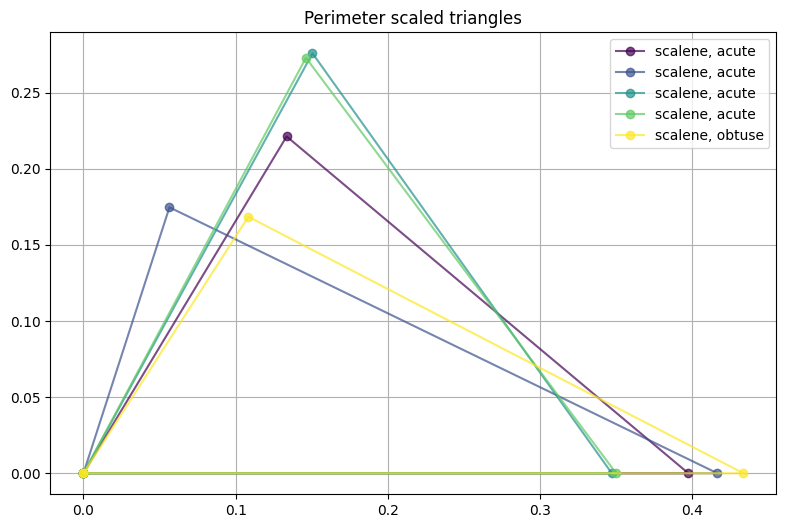
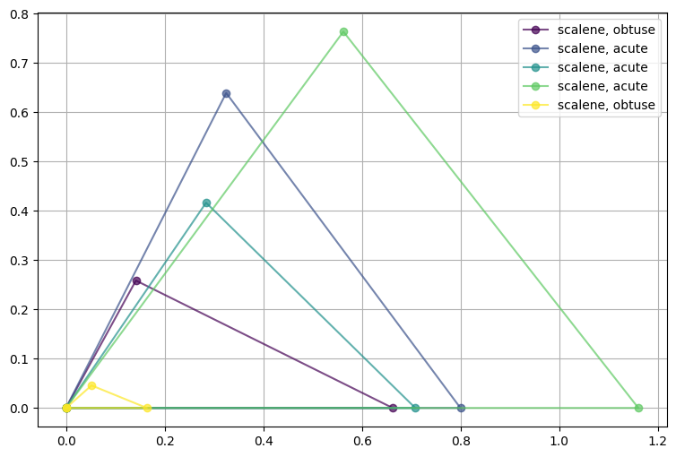
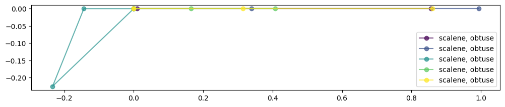
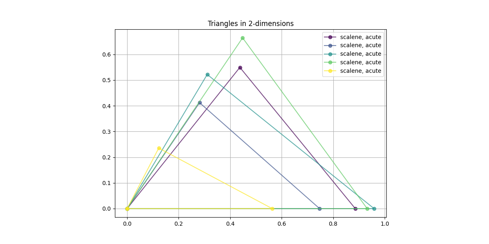
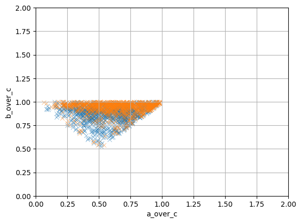
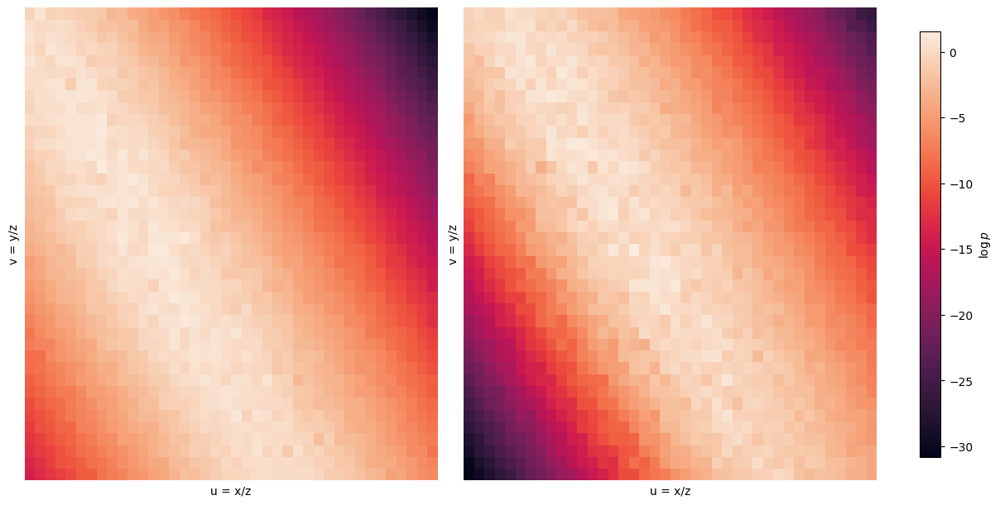
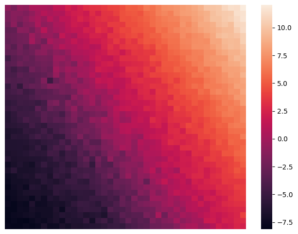

<a id="diffusion-on-the-edge-part-ii-maximal-manifold-exploration"></a>
# Diffusion on the edge - Part II: Maximal manifold exploration


```python
import torch
import torch.nn as nn
import numpy as np
import pandas as pd
import seaborn as sns

from diffusion_on_the_edge.core.grid import TimeGrid
from diffusion_on_the_edge.processes import OUTorchParams, OUTorch
from diffusion_on_the_edge.data.ou_dataset import OUDiffusionDatasetVectorized
from diffusion_on_the_edge.data.triangle_dataset import DatasetOptions, generate_triangle_dataset, dataset_from_sides
from diffusion_on_the_edge.modeling.model import SimpleScoreNet
from diffusion_on_the_edge.modeling.training import train_scorenet, TrainConfig
from diffusion_on_the_edge.sde.torch_backend import reverse_pc_sampler_torch
from diffusion_on_the_edge.modeling.tuning_model import build_teacher_student

ASSETS_FOLDER = './assets'
```


```python
# Dataset sizes
B, D = 1024, 3
ou_params = OUTorchParams(dim = 4, theta = 0.3, sigma = 0.5)
grid = TimeGrid(t0 = 0, t1 = 1, N = 101)
dataset_params = DatasetOptions(
    n_samples=B,
    side_bias={'equilateral': 0.00, 'isosceles': 0.05, 'scalene': 0.95},
    angle_bias={'right': 0.00, 'acute': 0.90, 'obtuse': 0.1},
)
```


```python
# Generate dataset with both side and angle biases
dataset_df = generate_triangle_dataset(dataset_params)
dataset_df.head()
```
<pre><code class="language-output">a         b         c side_type angle_type  angle_A_deg  \
0  0.376802  0.390557  0.534150   scalene      acute    44.835878   
1  0.188496  0.494622  0.496998   scalene      acute    21.914174   
2  0.573584  0.795410  0.957273   scalene      acute    36.758696   
3  0.801615  0.821972  0.932127   scalene      acute    53.944037   
4  0.713944  0.818943  0.880056   scalene      acute    49.535806   

   angle_B_deg  angle_C_deg  perimeter      area  a_over_c  b_over_c  \
0    46.954934    88.209188   1.301509  0.073545  0.705423  0.731174   
1    78.333841    79.751985   1.180116  0.045873  0.379268  0.995219   
2    56.087156    87.154148   2.326267  0.227836  0.599185  0.830912   
3    55.993345    70.062617   2.555715  0.309707  0.859985  0.881824   
4    60.774273    69.689922   2.412943  0.274164  0.811249  0.930558   

          x         y  a_over_l  b_over_l  c_over_l  
0  0.257195  0.275373  0.289512  0.300080  0.410408  
1  0.038115  0.184602  0.159726  0.419130  0.421144  
2  0.320020  0.476010  0.246568  0.341925  0.411506  
3  0.448335  0.664517  0.313656  0.321621  0.364723  
4  0.348584  0.623061  0.295881  0.339396  0.364723</code></pre>
In the previous part, we explored the basics of score-matching based diffusion models and continous-time stochastic processes.  
This follow up piece will walk through the basic ideas explored in the paper _Provable Maximum Entropy Manifold Exploration via Diffusion Models_ by De Santi et al.


```python
import matplotlib.pyplot as plt

def plot_triangle(a, b, c, ax, label=None, color='blue'):
    """
    Plot a triangle in 2D given side lengths a, b, c.
    Triangle ABC with:
        A at (0, 0),
        B at (c, 0),
        C determined by cosine law from a, b, c
    """
    # Fixed base AB
    A = np.array([0, 0])
    B = np.array([c, 0])
    
    # Use law of cosines to find angle at C
    cos_angle = (a**2 + c**2 - b**2) / (2 * a * c)
    cos_angle = np.clip(cos_angle, -1, 1)  # numerical safety
    angle = np.arccos(cos_angle)
    # Coordinates of C using polar transformation from A
    C = np.array([a * np.cos(angle), a * np.sin(angle)])
    triangle = np.array([A, B, C, A])
    ax.plot(triangle[:, 0], triangle[:, 1], marker='o', color=color, label=label, alpha = 0.7)
    ax.set_aspect('equal')

def visualize_sample_triangles(df, n=5):
    """
    Visualize n triangles from the dataframe.
    """
    fig, ax = plt.subplots(figsize=(12, 6))
    sample: pd.DataFrame = df.sample(n=n).reset_index()
    colors = plt.cm.viridis(np.linspace(0, 1, n))
    
    for i, row in sample.iterrows():
        a, b, c = row.a, row.b, row.c # Assumes first three are the sides
        plot_triangle(a, b, c, ax, label=f"{row.side_type}, {row.angle_type}", color=colors[i])
    
    ax.legend()
    return fig, ax
```


```python
# Visualize a few triangles
fig, ax = visualize_sample_triangles(dataset_df, n=5)
ax.grid()
ax.set_title('Triangles in 2-dimensions')
fig.savefig(f'{ASSETS_FOLDER}/triangle_plot.png')
plt.close()
```

<a id="main-concept"></a>
## Main concept

The paper introduces the concept of exploring the data manifold maximally by fine tuning a pre-learned diffusion model. Mathematically, the paper describes how diffusion models can miss some of the underlying data distribution. Our goal is to implement the described S-MEME algorithm and generate samples from low-density regions of the data manifold.


```python
# Plotting perimeter normalized triangles
plotting_df = dataset_df[['a_over_l', 'b_over_l', 'c_over_l', 'side_type', 'angle_type']].rename({'a_over_l': 'a', 'b_over_l': 'b', 'c_over_l': 'c'}, axis = 1)
fig, ax = visualize_sample_triangles(plotting_df)
ax.grid()
ax.set_title('Perimeter scaled triangles')
```
<pre><code class="language-output">Text(0.5, 1.0, &#39;Perimeter scaled triangles&#39;)</code></pre><div class="nb-output">
  

    

    

  
</div>
<a id="dataset"></a>
## Dataset


```python
ou_process = OUTorch(ou_params)
```


```python
model = SimpleScoreNet(input_dimension=4, layer_count=4, hidden_dim=256)
```

For simplicity, as we develop this implementation code we should have a simple and robust dataset on hand. 


```python
scaled_dataset = dataset_df[['a_over_l', 'b_over_l', 'c_over_l', 'perimeter']].to_numpy()
scaled_dataset_torch = torch.from_numpy(scaled_dataset)
means = scaled_dataset_torch.mean(dim = 0)
stds = scaled_dataset_torch.std(dim = 0)
scaled_dataset_torch = (scaled_dataset_torch - means) / stds

print(scaled_dataset_torch.max())
print(scaled_dataset_torch.min())
print(scaled_dataset_torch.mean())


dataset = OUDiffusionDatasetVectorized(
    ou_process,
    x0_pool=scaled_dataset_torch,
    T_max=grid.t1,
    batch_size=32,
    batches_per_epoch=100
)
dataloader = torch.utils.data.DataLoader(dataset, batch_size=None)
```
<pre><code class="language-output">tensor(3.5912, dtype=torch.float64)
tensor(-3.7140, dtype=torch.float64)
tensor(1.3531e-16, dtype=torch.float64)</code></pre>

```python
# Train the scoring model on the triangle dataset
config = TrainConfig(epochs=16, lr=0.01)
train_result = train_scorenet(model, dataloader, cfg=config)
train_result
```
<pre><code class="language-output">Epoch 1/16: 100it [00:00, 473.13it/s, loss=9.83]
Epoch 2/16: 100it [00:00, 777.25it/s, loss=8.88]
Epoch 3/16: 100it [00:00, 778.51it/s, loss=7.23]
Epoch 4/16: 100it [00:00, 728.68it/s, loss=6.71]
Epoch 5/16: 100it [00:00, 764.74it/s, loss=6.85]
Epoch 6/16: 100it [00:00, 782.14it/s, loss=6.59]
Epoch 7/16: 100it [00:00, 783.31it/s, loss=6.36]
Epoch 8/16: 100it [00:00, 778.21it/s, loss=6.36]
Epoch 9/16: 100it [00:00, 776.76it/s, loss=6.29]
Epoch 10/16: 100it [00:00, 775.99it/s, loss=6.41]
Epoch 11/16: 100it [00:00, 775.75it/s, loss=6.4]
Epoch 12/16: 100it [00:00, 766.80it/s, loss=6.36]
Epoch 13/16: 100it [00:00, 779.52it/s, loss=6.03]
Epoch 14/16: 100it [00:00, 775.86it/s, loss=6.34]
Epoch 15/16: 100it [00:00, 777.78it/s, loss=6.29]
Epoch 16/16: 100it [00:00, 773.98it/s, loss=6.35]</code></pre><pre><code class="language-output">{&#39;model&#39;: SimpleScoreNet(
   (time_emb): SinusoidalTimeEmbedding()
   (net): Sequential(
     (0): Linear(in_features=68, out_features=256, bias=True)
     (1): ReLU(inplace=True)
     (2): Linear(in_features=256, out_features=256, bias=True)
     (3): ReLU(inplace=True)
     (4): Linear(in_features=256, out_features=256, bias=True)
     (5): ReLU(inplace=True)
     (6): Linear(in_features=256, out_features=256, bias=True)
     (7): ReLU(inplace=True)
     (8): Linear(in_features=256, out_features=4, bias=True)
   )
 ),
 &#39;losses&#39;: [9.831674518585205,
  8.875641875267029,
  7.230103254318237,
  6.708644905090332,
  6.852216730117798,
  6.594032688140869,
  6.36336841583252,
  6.358727502822876,
  6.288545458316803,
  6.413940625190735,
  6.402638936042786,
  6.364014232158661,
  6.027213461399079,
  6.342818851470947,
  6.288363084793091,
  6.352544288635254]}</code></pre>
Let's take as our fundamental data manifold all possible 2D-triangles based on distance. So each data point is a triplet of numbers, $(a, b, c)$ where the measurements $a, b, c$ are distances between points $A, B, C$ defined as $a = |AB|, b = |BC|, c = |CA|$. All of these points lie on some non-trivial submanifold of $\mathbb{R}^3$. For simplicity, let's also constrict the distances to be less than $1$. Therefore, the possible data points lie as a subset of the unit cube, $(a, b, c) \in [0, 1]^3$. Furthermore, let always be true that $a \leq b \leq c$, so we maintain an order on the sides.


```python

```


```python

# Generate random samples
x_T = torch.randn(B, D + 1).to('cpu')

# Get the trained model and put in 'eval' mode.
score_model: nn.Module = train_result.get('model')
score_model.to('cpu').eval()

# Generate new samples using backwards SDE
samples = reverse_pc_sampler_torch(
    x_T=x_T,
    process=ou_process,
    score_model=score_model,
    grid = grid,
    snr=0.15,
)

# Transform back from perimeter scaled values
transformed_samples = samples * stds + means
samples_arr = transformed_samples.detach().cpu().numpy()
samples_arr = samples_arr[:, :3] * samples_arr[:, 3].reshape(-1, 1)
```


```python
generation_options = DatasetOptions(include_geometry=True, include_normalized_sides=True, include_perimeter_normalized_sides=False, include_planar_embedding=False)
generated_df = dataset_from_sides(samples_arr, generation_options)
generated_df['is_valid_triangle'].value_counts(normalize=True)
```
<pre><code class="language-output">is_valid_triangle
True     0.96875
False    0.03125
Name: proportion, dtype: float64</code></pre>
<a id="transformations"></a>
## Transformations


```python
fig, ax = visualize_sample_triangles(generated_df[generated_df['is_valid_triangle']])
ax.grid()
```
<div class="nb-output">
  

    

    

  
</div>
We will utilize some transformations for the raw side lengths


```python
visualize_sample_triangles(generated_df[~generated_df['is_valid_triangle']], n = 5)
```
<pre><code class="language-output">(&lt;Figure size 1200x600 with 1 Axes&gt;, &lt;Axes: &gt;)</code></pre><div class="nb-output">
  

    

    

  
</div>
- Side normalized $(a, b, c) = (a / c, b / c, 1)$
- Perimeter normalized $(a, b, c) = (a / l, b / l, c / l)$ where $l = a + b + c$

For training neural networks, we do a mean and standard deviation scaling as well, on top of these two normalization approaches.

Next, we can take a look at our generated dataset of triangles.


```python

```


```python
teacher_tuning, student_tuning = build_teacher_student(pretrained_score_model=score_model, d = 4, hidden_size=64)
```


```python
INNER_EPOCHS = 10
OUTER_EPOCHS = 5

beta = 5.0
lambda_prox = 0.001

BATCH_SIZE = 32
DATASET_SIZE = 2 ** 10

def is_valid_triangle_torch(x_prescaled: torch.Tensor):
    x = (x_prescaled + 1) / 2
    a, b, c = torch.sort(x, dim=1).values.unbind(dim=1)
    return (a + b > c) & (a + c > b) & (b + c > a)

optimizer = torch.optim.AdamW(student_tuning.delta.parameters(), lr = 0.0001)

# Tuning loop
for epoch in range(OUTER_EPOCHS):
    # Generate new samples using score model
    x_T = torch.randn(size=(DATASET_SIZE, 4))
    with torch.no_grad():
        samples = reverse_pc_sampler_torch(
            x_T=x_T,
            process=ou_process,
            score_model=student_tuning,
            grid=grid,
            snr=0.15,
        )

        inverse_normalized = stds * samples + means # Inverse the normalization
    
    raw_lengths = inverse_normalized[:, :3] * inverse_normalized[:, [3]]
    # Check valid triangles
    validity_result = is_valid_triangle_torch(x_prescaled=raw_lengths)
    valid_samples = samples[validity_result]

    generated_dataset = OUDiffusionDatasetVectorized(
        process=ou_process,
        x0_pool=valid_samples.detach(),
        T_max=grid.t1,
        batch_size=BATCH_SIZE,
        batches_per_epoch=max(1, valid_samples.shape[0] // BATCH_SIZE),
    )
    
    generated_dataloader = torch.utils.data.DataLoader(generated_dataset, batch_size=None)
    teacher_tuning.load_state_dict(student_tuning.state_dict())
    teacher_tuning.eval()
    student_tuning.train()

    # Inner loop
    losses = []
    for inner_epoch in range(INNER_EPOCHS):
        for batch in generated_dataloader:
            optimizer.zero_grad()

            # Get training elements
            t = batch.get('t')
            x = batch.get('xt')
            score = batch.get('score')

            # Obtain a weight for the smallest t (corresponding to close the original data distribution)
            w_T = (t <= 0.1 * grid.t1).float()

            # Forward pass to tuning models
            student_prediction = student_tuning(x, t)
            with torch.no_grad():
                teacher_prediction = teacher_tuning(x, t)

            delta = student_prediction - teacher_prediction
            delta_loss = lambda_prox * torch.sum(delta ** 2, dim = 1).mean()

            # Direction loss
            dir_term = (-teacher_prediction * delta).sum(dim = 1)
            direction_loss = (beta * dir_term * w_T).mean()
            loss = delta_loss - direction_loss
            loss.backward()
            optimizer.step()

            losses.append([x_.detach().cpu().numpy() for x_ in [loss, delta_loss, direction_loss]])

    losses = np.asarray(losses)
```

</img>


```python
samples_tuned = reverse_pc_sampler_torch(
    x_T=x_T, # Note: We use the same input sample as the original model
    process=ou_process,
    score_model=student_tuning,
    grid=grid,
    snr=0.15,
) 
samples_tuned = samples_tuned * stds + means
samples_arr_tuned = samples_tuned.detach().cpu().numpy()
```


```python
student_generated = dataset_from_sides(samples_arr_tuned[:, :3] * samples_arr_tuned[:, [3]], generation_options)
student_generated['is_valid_triangle'].value_counts(normalize=True)
```
<pre><code class="language-output">is_valid_triangle
True     0.958008
False    0.041992
Name: proportion, dtype: float64</code></pre>
Our dataset contains normalized side lengths as well, below is a plot of the perimeter scaled versions.

<a id="modeling"></a>
# Modeling


```python
sns.scatterplot(generated_df[generated_df['is_valid_triangle']], x = 'a_over_c', y = 'b_over_c', alpha=0.7, marker='x').set(xlim=(0, 2), ylim=(0, 2), alpha = 0.3)
sns.scatterplot(student_generated[student_generated['is_valid_triangle']], x = 'a_over_c', y = 'b_over_c', alpha=0.7, marker='x').set(xlim=(0, 2), ylim=(0, 2), alpha = 0.3)
plt.grid()
```
<div class="nb-output">
  

    

    

  
</div>
We create a $4$-dimensional OU diffusion process with specific $\lambda$ and $\sigma$ parameters, as described in the first part. Alongside it, we create a neural network model to be our first training model.


```python
comparison_dfs = [student_generated, generated_df]
side_types_df = pd.concat([df['side_type'].value_counts(normalize=True) for df in comparison_dfs], axis = 1).fillna(0)
side_types_df.columns = ["student", "original"]
side_types_df
```
<pre><code class="language-output">student  original
side_type                      
scalene      0.961914  0.991211
isosceles    0.036133  0.008789
equilateral  0.001953  0.000000</code></pre>

```python
angle_types_df = pd.concat([df['angle_type'].value_counts(normalize=True) for df in comparison_dfs], axis = 1).fillna(0)
angle_types_df.columns = ["student", "original"]
angle_types_df
```
<pre><code class="language-output">student  original
angle_type                    
acute       0.879883  0.604492
obtuse      0.119141  0.391602
right       0.000977  0.003906</code></pre>
Now we define an iterable dataset for the diffusion model, the dataset contains tuples $(X, t, \nabla_x p_t(x))$.


```python
from diffusion_on_the_edge.sde.torch_backend import pf_logp_from_x0
```


```python
density_prior_variance = float((ou_params.sigma ** 2) / (2 * ou_params.theta) * (1 - np.exp(-2 * ou_params.theta * grid.t1))) # T = 1.0
density_prior_variance
```
<pre><code class="language-output">0.187995151627489</code></pre>

```python
def make_uv_heatmap_with_pfode(
    score_model,
    ou_process,
    prior_variance,                 # your OU prior at T
    timegrid,
    u_range=(-1.0, 1.0), v_range=(-1.0, 1.0),
    res=40, 
    n_probe=2,
    c=1.0,
    mask_fn=None,                  # e.g., triangle inequality in (u,v)
):
    import numpy as np, torch
    us = np.linspace(*u_range, res)
    vs = np.linspace(*v_range, res)
    U, V = np.meshgrid(us, vs, indexing="xy")

    # Map (u,v) -> (x,y,z) with z=c
    xyz = np.stack([c*U.ravel(), c*V.ravel(), np.full(U.size, c)], axis=-1)
    perimeter = np.sum(xyz, axis = 1, keepdims=True)
    xyzp = np.hstack([xyz, perimeter])
    x0 = torch.tensor(xyzp, dtype=torch.float)

    logp0 = pf_logp_from_x0(
        x0, ou_process, score_model, prior_variance,
        grid=timegrid, n_probe=n_probe
    ).detach().cpu().numpy().reshape(res, res)

    # Optional: apply mask in UV-space
    if mask_fn is not None:
        M = mask_fn(U, V)   # boolean mask of shape (res,res)
        logp0 = np.where(M, logp0, np.nan)

    return logp0, us, vs
```


```python
plotting_c = 0.2
logp, _, _ = make_uv_heatmap_with_pfode(score_model, ou_process, density_prior_variance, timegrid=grid, c = plotting_c)
logp_student, _, _ = make_uv_heatmap_with_pfode(student_tuning, ou_process, density_prior_variance, timegrid=grid, c = plotting_c)

fig, ax = plt.subplots(1, 2, figsize=(12,6), constrained_layout=True)
original_map = sns.heatmap(
    logp,
    ax=ax[0],
    cbar=False,
    mask=np.isnan(logp) if 'logp' in locals() else None,  # or mask=~mask
    xticklabels=False, yticklabels=False  # turn off if res is large
)
ax[0].set_xlabel("u = x/z")
ax[0].set_ylabel("v = y/z")
ax[0].invert_yaxis()

student_map = sns.heatmap(
    logp_student,
    ax=ax[1],
    cbar=False,
    mask=np.isnan(logp) if 'logp' in locals() else None,
    xticklabels=False, 
    yticklabels=False
)
ax[1].set_xlabel("u = x/z")
ax[1].set_ylabel("v = y/z")
ax[1].invert_yaxis()

cbar = fig.colorbar(original_map.collections[0], ax=ax, location="right", shrink=0.9)
cbar.set_label("$\\log p$")
plt.show()
```
<div class="nb-output">
  

    

    

  
</div>

```python
difference_map = logp_student - logp
fig, ax = plt.subplots(figsize=(8, 6))

sns.heatmap(
    difference_map,
    ax = ax,
    xticklabels=False,
    yticklabels=False
)

ax.invert_yaxis()
```
<div class="nb-output">
  

    

    

  
</div>
In other words, the iterable dataset generates samples $x \sim X_t$ from the diffusion process from the starting set of triangles. Alonside the samples, we compute the correct value for the gradient of the density $p_t(x)$. We use the normalized side lengths and provide the perimeter as an additional feature $X = (a / l, b / l, c / l, l)$. After the perimeter normalization, we also compute the mean and standard deviation, and use them as a second normalization step for the network.
